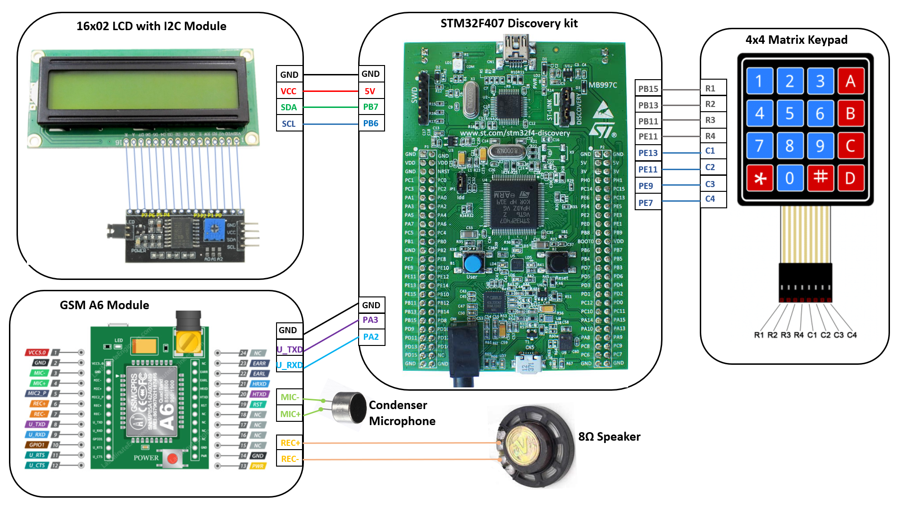

# Basic Mobile Phone Using STM32F407 Discovery kit and GSM module A6 Module
This is repository guides you on how you can build a **Basic Mobile Phone** using STM32F407 Microcontroller and GSM A6 module. This project has 3 main components, they are:

1. **GSM A6 Module**
2. **LCD 16x02**
3. **Hex Keypad** 

To make the programming easier and organized, I have developed individual driver code for interfacing GSM A6 module, LCD 16x02 and Hex Keypad on STM32F407 MCU. You can find these drivers below: 

* [Interfacing GSM-A6 Module on STM32F407 Discovery Kit](https://github.com/SharathN25/GSM_A6_Driver_STM32F407)
* [Interfacing 16x02 LCD on STM32F407 Discovery using I2C module](https://github.com/SharathN25/LDC16x02_I2C_Driver_STM32F407)
* [Interfacing 4X4 Matrix Keypad on STM32F407 Discovery Kit](https://github.com/SharathN25/4x4_Matrix_Keypad_Driver_STM32F407)

After developing these drivers I simply included these driver files in my project and used the respective APIs in the main program.

## Components used and connnection detail
The hardware components required for this project are : 
1. STM32F407 Discovery Kit
2. LCD 16x02 and I2C Module
3. GSM A6 Module
4. Hex Keypad
5. 8Ω Speakers and Condensor Microphone 

**Connections are made as shown in the below figure :**

## Upload the code
Once connections are made, upload the code in the project **[Basic_MobilePhone_STM32F407_GSM_A6_Project](https://github.com/SharathN25/Basic_MobilePhone_Using_STM32F407andGSM_A6/tree/master/Basic_MobilePhone_STM32F407_GSM_A6_Project)** using the Kiel uVision IDE. 

## You can find the more detailed steps for building Basic Mobile Phone below
 **Instructables Link -->** 
